<h1 align="center">Varnamala 🦚</h1>

<p align="center">
  <b>The language courses nobody else will build.</b><br>
  Thirteen Indian languages. Open source, ad-free, and free forever.
</p>

<p align="center">
  <a href="https://words625-22704.web.app/#/showcase"></a>
</p>

<p align="center">
  
  
  
  
  
  <a href="https://discord.gg/eVpmZp4Ktt"></a>
  <a href="https://www.patreon.com/16665184/join"></a>
</p>

<p align="center">
  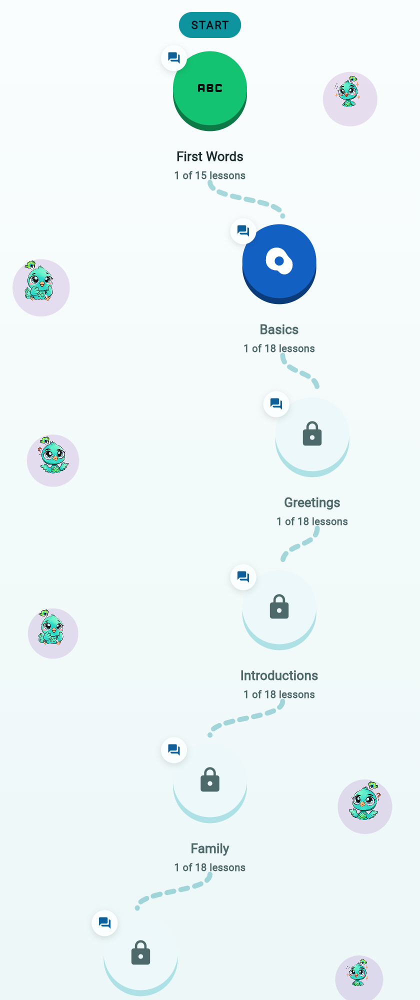
  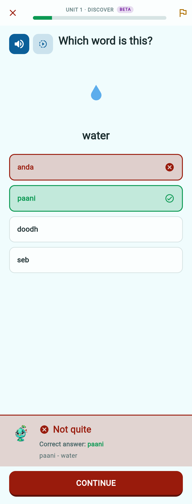
  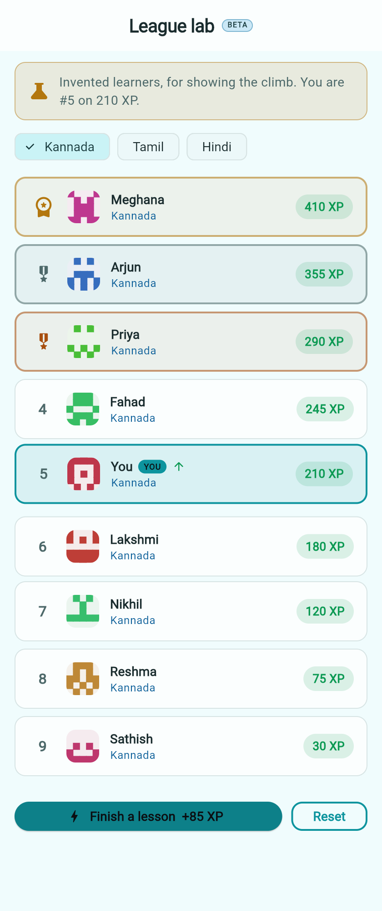
</p>

---

## Why this exists

Duolingo teaches High Valyrian. It does not teach Kannada, Malayalam, Odia or
Assamese — languages with tens of millions of speakers each. The economics of a
venture-backed app never reach them, and they never will.

So we build those instead.

- **No hearts, no energy.** Learning shouldn't stop because you made a mistake.
  Ours genuinely don't deplete — that's a line in the source, not a slogan.
- **No pay-to-win, no ads, no dark patterns.** A lesson is never behind a wall.
- **Judged on the word, not the spelling.** Romanized Indian languages have no
  single correct spelling. *dhanyavaad*, *danyavad* and *dhanyavad* are one word
  written by three people, and all three are accepted.
- **Your name is yours.** The leaderboard shows a handle and a generated avatar.
  Your real name and email are never visible to another learner.

---

## Languages

Thirteen live today, each with **16 courses** — a picture-led *First words*
course of sixty everyday words, then fifteen sentence courses. **10,530
authored questions** and **780 illustrated words** in total.

| | | | |
|---|---|---|---|
| **Assamese** অসমীয়া | **Bengali** বাংলা | **Gujarati** ગુજરાતી | **Hindi** हिन्दी |
| **Kannada** ಕನ್ನಡ | **Malayalam** മലയാളം | **Marathi** मराठी | **Nepali** नेपाली |
| **Odia** ଓଡ଼ିଆ | **Sanskrit** संस्कृतम् | **Tamil** தமிழ் | **Telugu** తెలుగు |
| **Urdu** اردو | | | |

**India is where we started, not where we stop.** The same engine and the same
JSON course format work for any language. We especially want to host the ones
big platforms have skipped — Native American and First Nations languages,
Indigenous languages of Latin America and the Pacific, and minority and
endangered languages anywhere.

We are not writing those courses ourselves. A language belongs to the people who
speak it, and many communities hold their own protocols about who may teach and
record theirs. What we provide is the platform, the tooling and the hosting —
free, forever, with the content under your control. If you speak one of these
languages and want it on Varnamala,
**[open an issue](https://github.com/rshrc/Varnamala/issues)** and we will help
you build it.

---

## A look around

### Words before sentences

Sixty everyday words, taught with pictures and audio, before you are asked to
build a single sentence. Learners told us they were assembling sentences out of
vocabulary nobody had taught them, so *First words* now opens every path.

<table>
<tr>
<td width="33%">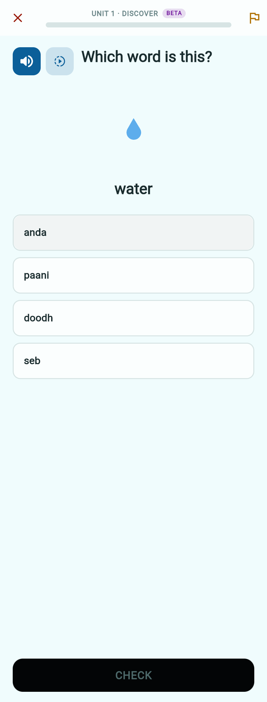</td>
<td width="33%">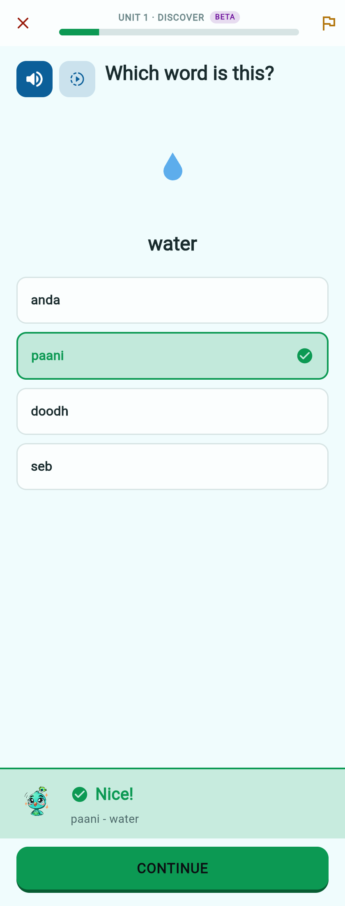</td>
<td width="33%"></td>
</tr>
<tr>
<td>A picture, its meaning, and the word read aloud — normally, or slowly.</td>
<td>The verdict lands on the tile you touched, with a sound and a haptic.</td>
<td><b>A miss marks <i>your</i> pick and lights up the right answer</b>, then says what it meant. No hearts lost, no lockout.</td>
</tr>
</table>

### Then sentences, thirteen ways

One authored question becomes six kinds of exercise — choice, word bank,
sentence order, fill-the-blank by choice or by typing, picture matching — so
the same content is met from several angles rather than drilled once.

<table>
<tr>
<td width="33%">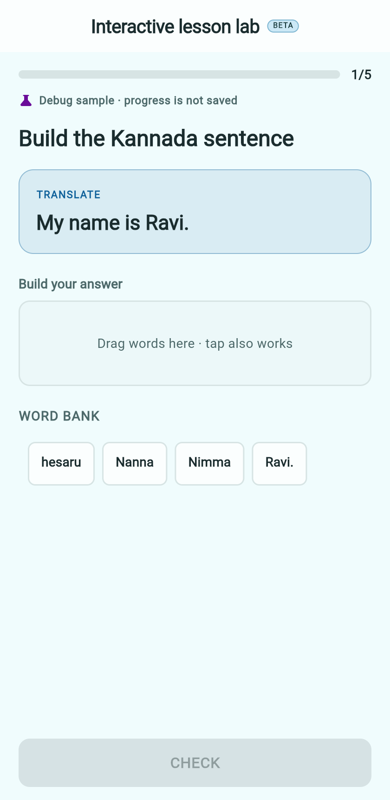</td>
<td width="33%"></td>
<td width="33%">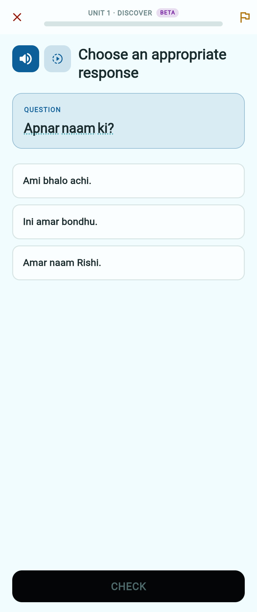</td>
</tr>
<tr>
<td>Drag or tap words into place — never one without the other.</td>
<td>Tamil.</td>
<td>Bengali. Same engine, thirteen languages.</td>
</tr>
</table>

### Learning the script

Romanization gets you speaking. It does not get you reading a signboard. Every
vowel and consonant of all thirteen writing systems is here, with sound and a
tracing canvas.

<table>
<tr>
<td width="33%">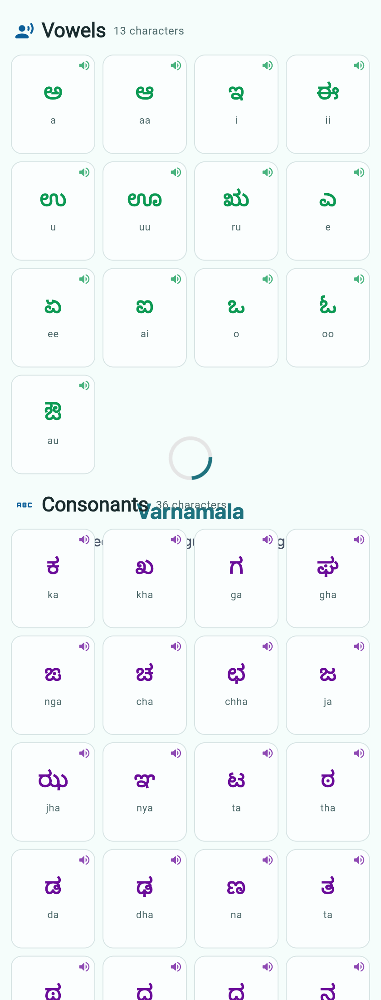</td>
<td width="33%">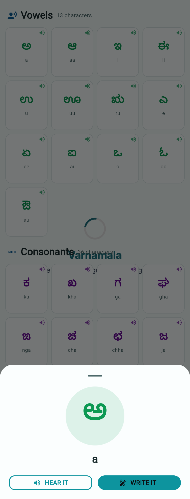</td>
<td width="33%">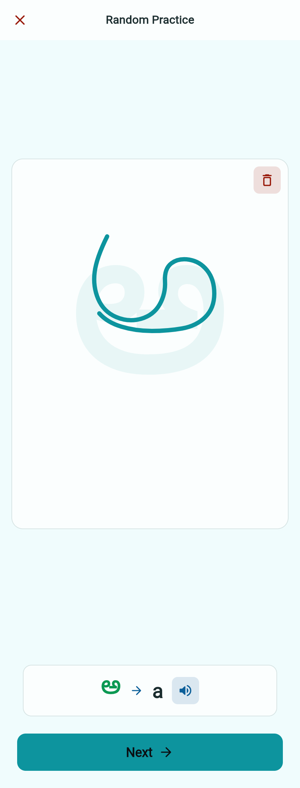</td>
</tr>
<tr>
<td>Every letter, each with its sound.</td>
<td>Tap one to hear it or to practise writing it.</td>
<td>Trace over the guide, clear it, try again.</td>
</tr>
</table>

### Practice that comes back to you

<table>
<tr>
<td width="33%">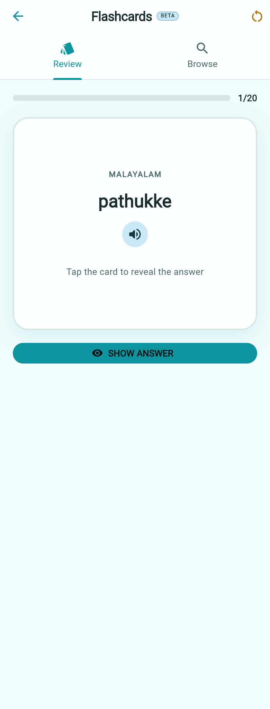</td>
<td width="33%">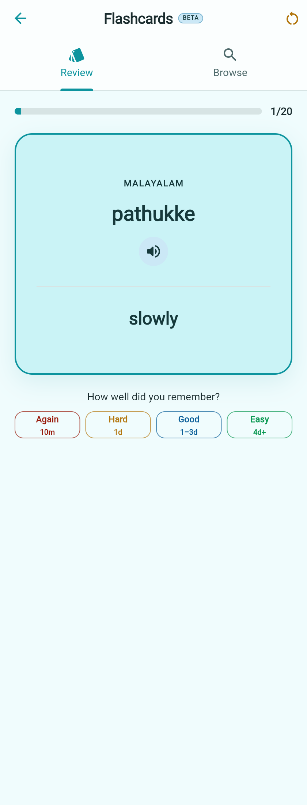</td>
<td width="33%">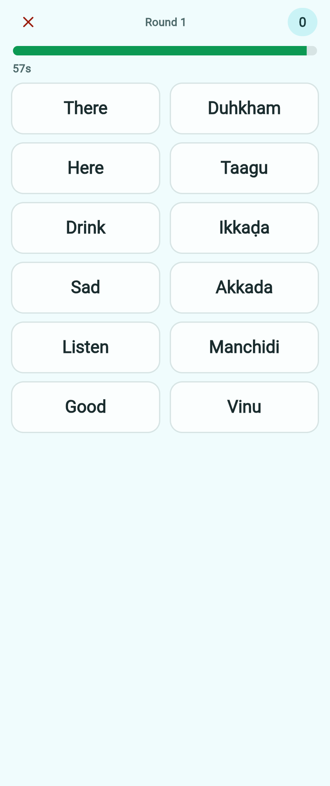</td>
</tr>
<tr>
<td>Cards sorted into new, due, learning and mastered — in either direction.</td>
<td>Turn it over and say how it went. Difficult words come back sooner.</td>
<td>Match Madness: pair words against a clock that never gets kinder.</td>
</tr>
</table>

### Leagues you race in your own language

A Tamil learner competes with Tamil learners. XP earned in one language counts
for nothing in another, so nobody outranks you on a board they do not study.

<table>
<tr>
<td width="50%"></td>
<td width="50%">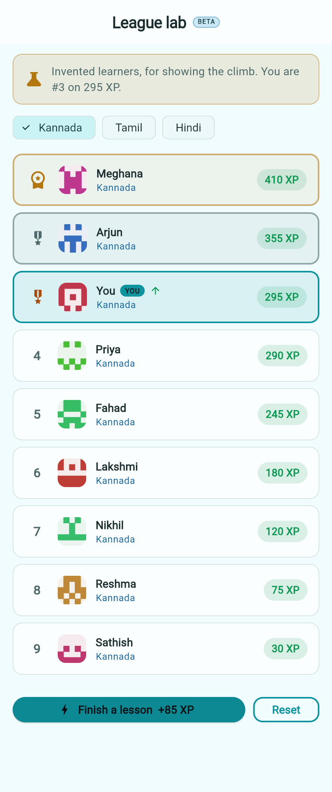</td>
</tr>
<tr>
<td>Finish a lesson and you <i>watch</i> yourself overtake people — the rows genuinely move, caught here mid-slide.</td>
<td>Land in the top three and the place is marked: a crown for first, medals for second and third, each with its own arrival.</td>
</tr>
</table>

<sub>Captured from the app at <code>localhost:5050</code>. The
<code>/showcase</code> and <code>/league-lab</code> routes are deliberately
unguarded, so a headless browser — and anyone being shown the app — can reach
these screens without an account.</sub>

---

## Contributing

**Adding a language means writing JSON, not Dart.** Lesson content lives as
hand-editable files under `assets/courses/<language>/`, and a Ruby validator
checks your work before it ever reaches the app.

```bash
ruby tool/validate_courses.rb            # every language
ruby tool/validate_courses.rb tamil      # just one
```

Start with **[docs/course-authoring.md](docs/course-authoring.md)** — it has the
full schema, the content rules, and worked examples.

### Running it locally

```bash
git clone https://github.com/rshrc/Varnamala
cd Varnamala
flutter pub get
flutter pub run build_runner build --delete-conflicting-outputs
flutter run
```

You will need your own `google-services.json` (Android) and
`GoogleService-Info.plist` (iOS) for the Firebase features — see
[FIREBASE_CONFIGURATION.md](FIREBASE_CONFIGURATION.md). The
[development guide](DEVELOPMENT.md) lists the access to ask for.

**Everything is welcome:** a bug fix, a new language course, a better
illustration, a correction to a sentence that no native speaker would say.

---

## How it is built

- **Flutter + Firebase.** Provider for state, GetIt and Injectable for wiring,
  Freezed for models, Auto Route for navigation.
- **Content is data, not code.** Sixteen courses per language as JSON, loaded
  and cached per language, with a Ruby validator and a Dart test suite over it.
- **Courses can update without an app release.** A published release in
  Firestore overrides the bundled JSON, and the bundle is the offline fallback.
- **Exercises are generated, not authored one by one.** One reviewed question
  becomes six kinds of interaction, seeded so a rebuild never reshuffles the
  tiles under your thumb.
- **Theming is systematic.** Six palettes × light and dark, every colour derived
  from hue relationships, with a test that fails any palette below WCAG
  contrast.

---

## Roadmap

**Shipped**
- 13 languages × 16 courses — 10,530 questions and 780 illustrated words
- *First words* — sixty everyday words with pictures, before any sentence
- Six exercise types with adaptive retry
- Per-language leagues, with the climb animated
- Script practice and letter tracing for all thirteen writing systems
- Flashcard review with spaced repetition
- Text-to-speech per language, at normal and slow speed
- Six colour themes, light and dark, contrast-tested

**Next**
- Daily practice reminders
- Listening and speaking exercises
- Native script alongside the romanization
- Courses taught *from* an Indian language, not only from English

**Wanted**
- Native American and First Nations languages
- Indigenous languages of Latin America and the Pacific
- Any minority or endangered language with speakers willing to author it

---

## Support

This is a passion project. If you believe in open, ad-free education:

<a href="https://www.patreon.com/16665184/join">
  
</a>

It pays for servers and keeps the app free forever. Contributing a course is
worth more than money.

---

<p align="center">
  <b>Join us in building a more learned world.</b><br>
  <sub>GPL-3.0 — anything built on this stays open.</sub>
</p>
